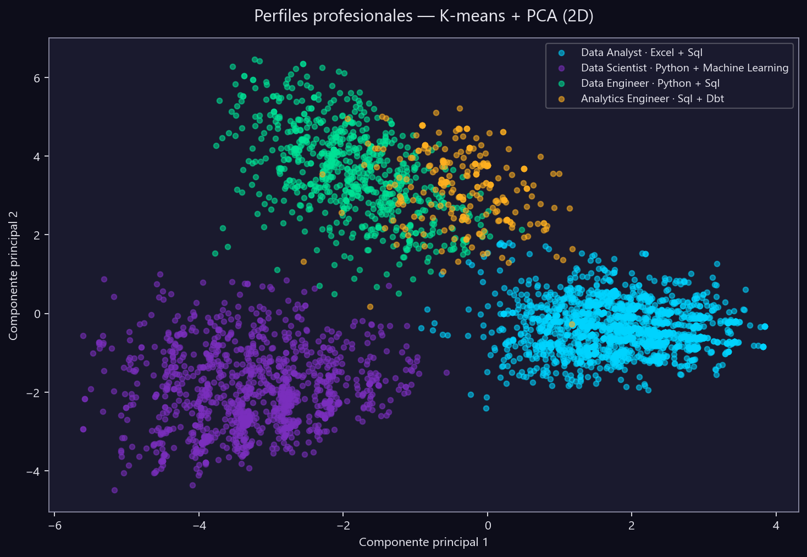
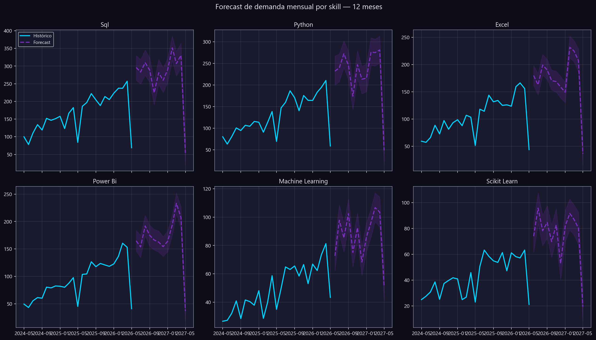
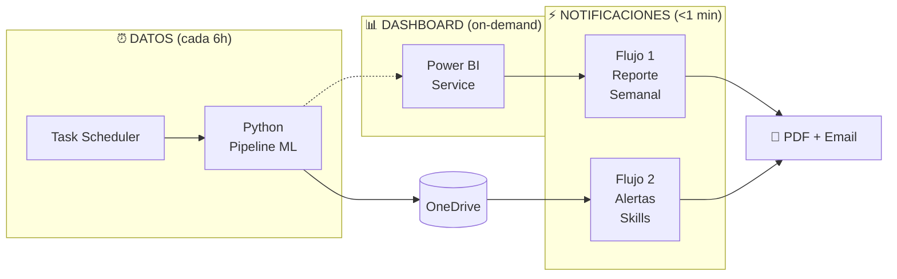

<div align="center">

# 🌌 Observatorio del Mercado Laboral en Datos & Tecnología

**Pipeline integral que recolecta, procesa, predice y comunica la demanda de skills tech del mercado laboral.**

[](https://www.python.org)
[](https://powerbi.microsoft.com)
[](https://powerautomate.microsoft.com)
[](https://facebook.github.io/prophet/)
[](https://scikit-learn.org)
[](LICENSE)
[]()

[**📑 Case Study completo →**](docs/case_study.md) · [**🏗️ Cómo construir el .pbix →**](powerbi/README.md) · [**⚡ Flujos Power Automate →**](power_automate/README.md)

</div>

---

## ✨ ¿Qué hace este proyecto?

Construye un **observatorio automatizado** que responde tres preguntas que importan tanto a profesionales como a empresas del sector datos:

1. **¿Qué skills se demandan ahora y cuáles están en declive?** — NLP sobre descripciones de ofertas + serie histórica.
2. **¿Cuánto vale una combinación de skills, experiencia y ubicación?** — modelo de regresión multivariable con R² = 0.93.
3. **¿Hacia dónde va la demanda los próximos 12 meses?** — forecast Prophet con intervalos de confianza.

Todo el sistema se refresca automáticamente vía Power Automate y envía reportes ejecutivos + alertas a los stakeholders.

---

## 📊 Vista rápida — outputs reales del pipeline

<table>
<tr>
<td width="50%">

**4 arquetipos profesionales identificados por K-means**



| Cluster | Salario | Skills |
|---|---:|---|
| Data Analyst | $50K | Excel · SQL · Power BI |
| Data Scientist | $85K | Python · ML |
| Data Engineer | $93.5K | Python · SQL · Spark |
| Analytics Engineer | $81K | SQL · dbt · Snowflake |

</td>
<td width="50%">

**Forecast Prophet 12 meses — top skills**



Tendencias detectadas:
- 📈 SQL, Python, Power BI: crecimiento sostenido
- 📈 Machine Learning, scikit-learn: aceleración reciente
- 🚨 Alertas activas: Redshift +350%, GCP +100%, BigQuery +65%

</td>
</tr>
</table>

---

## 🏗️ Arquitectura event-driven en 3 capas



| Capa | Latencia | Tecnología |
|---|---|---|
| 🟢 **Datos** | Cuasi-real-time (cada 6h) | Task Scheduler + Python ML pipeline |
| 🟢 **Notificaciones** | **Real-time (< 1 min)** | Power Automate event triggers |
| 🟡 **Dashboard** | On-demand | Power BI Service (refresh manual) |

📖 [**Arquitectura completa →**](power_automate/ARQUITECTURA_EVENT_DRIVEN.md) · [**Case study →**](docs/case_study.md#-arquitectura)

---

## 🚀 Quick Start

```powershell
# 1. Clonar
git clone https://github.com/IngBilbao/observatorio-mercado-laboral.git
cd observatorio-mercado-laboral

# 2. Entorno e instalación
py -3.12 -m venv .venv
.\.venv\Scripts\Activate.ps1
pip install -r python/requirements.txt
py -m spacy download en_core_web_sm

# 3. Configurar credenciales Adzuna (opcional)
cp .env.example .env
# editar .env con tu Application ID y API Key de https://developer.adzuna.com

# 4. Generar dataset sintético + ejecutar pipeline ML completo
py python/00_generar_datos_sinteticos.py
py python/99_pipeline.py

# 5. (Opcional) Incluir ofertas reales de Adzuna
py python/99_pipeline.py --con-adzuna --adzuna-paises es gb us mx

# 6. (Opcional) Programar el pipeline para que se ejecute cada 6 horas
.\scripts\programar_pipeline.ps1 -IntervaloHoras 6 -Rapido

# 7. Construir Power BI siguiendo powerbi/README.md
# 8. Construir flujos Power Automate siguiendo power_automate/README.md
```

---

## 📁 Estructura del repositorio

```
observatorio-mercado-laboral/
│
├── 📑 docs/
│   ├── case_study.md              ← caso de estudio completo (para reclutadores)
│   ├── diccionario_datos.md       ← esquema de cada CSV
│   ├── guia_visualizaciones.md    ← estándares visuales
│   └── imagenes/                  ← gráficos generados por el pipeline
│
├── 🐍 python/                     ← 11 scripts del pipeline
│   ├── utils.py                   ← paths, paleta Bilbao Analytics, helpers
│   ├── 00_generar_datos_sinteticos.py
│   ├── 01_extraccion.py           02_limpieza.py
│   ├── 03_nlp_skills.py           04_clustering.py
│   ├── 05_series_tiempo.py        06_regresion_salarios.py
│   ├── 07_verificar_outputs.py    08_generar_alertas.py
│   ├── 09_ingestar_adzuna.py      99_pipeline.py (orquestador)
│   └── requirements.txt
│
├── 📊 powerbi/
│   ├── README.md                  ← guía paso a paso del .pbix
│   ├── Observatorio.pbix
│   ├── etl/                       ← 8 scripts Power Query M
│   ├── dax/                       ← 5 archivos de medidas DAX
│   └── theme/bilbao_analytics_theme.json
│
├── ⚡ power_automate/
│   ├── README.md                  ← índice de flujos
│   ├── ARQUITECTURA_EVENT_DRIVEN.md ← diseño en 3 capas
│   ├── CONFIGURAR_REFRESH.md      ← (opcional) activar auto-refresh
│   ├── COMO_OBTENER_IDS.md        ← obtener Dataset/Report IDs
│   ├── flujo_01_reporte_semanal.md
│   └── flujo_02_alertas_skills.md
│
├── 🔧 scripts/
│   ├── README.md
│   └── programar_pipeline.ps1     ← Task Scheduler (capa de datos real-time)
│
├── 📦 data/  (gitignored)
│   ├── raw/                       ← descargas crudas (Adzuna, Kaggle)
│   ├── processed/                 ← datos limpios + matriz de skills
│   └── outputs/                   ← outputs ML para Power BI
│
├── 🔐 .env.example                ← template para credenciales
└── 📄 proyecto.md                 ← spec original del proyecto
```

---

## 🎯 Highlights técnicos

| Capa | Skill demostrada |
|---|---|
| **Python** | OOP ligero (dataclasses), CLI argparse, dotenv para secretos, logging UTF-8 cross-platform |
| **Data wrangling** | pandas/numpy con winsorize, unpivot, validaciones type-safe |
| **NLP** | Matching híbrido catálogo canónico + spaCy + regex con boundaries |
| **ML** | K-means con silueta para k óptimo, PCA 2D, regresión sobre `log(salario)`, validación 80/20 |
| **Series tiempo** | Prophet con estacionalidad anual + intervalos 80% para 12 skills |
| **REST APIs** | Cliente Adzuna con rate limiting, control de cuota, mapeo de schemas |
| **Power Query M** | Esquema estrella, parámetros reutilizables, tabla calendario en M, unpivot |
| **DAX** | Medidas con time intelligence (YTD/YoY/MoM), `USERELATIONSHIP`, formato condicional |
| **Power BI** | Tema JSON custom, 6 páginas tipificadas, mapas, forecast con bandas |
| **Power Automate** | Flujos por schedule + trigger de archivo, API Power BI, plantillas HTML email |
| **Git/GitHub** | Repo público con topics, secrets fuera del repo, commits informativos |

📋 **Lista completa con métricas en el [case study](docs/case_study.md).**

---

## 📈 Métricas del último run

| Métrica | Valor |
|---|---:|
| Ofertas procesadas | **5,237** (sintéticas + Adzuna reales) |
| Países cubiertos | 13 |
| Skills monitoreadas | 35 |
| Roles normalizados | 8 |
| Clusters identificados | 4 (silueta = 0.229) |
| Skills con forecast Prophet | 12 |
| R² modelo salarial | **0.93** |
| RMSE modelo salarial | ±$14,623 |
| Alertas MoM detectadas | 8 |
| Tiempo total pipeline | 0.4 min (--rapido) |

---

## 📜 Licencia

MIT — ver [`LICENSE`](LICENSE).

---

<div align="center">

**🌌 Construido por [Bilbao Analytics](https://github.com/IngBilbao)** · bilbao990512@gmail.com

*Los datos cuentan historias. Bilbao Analytics las hace audibles.*

</div>
