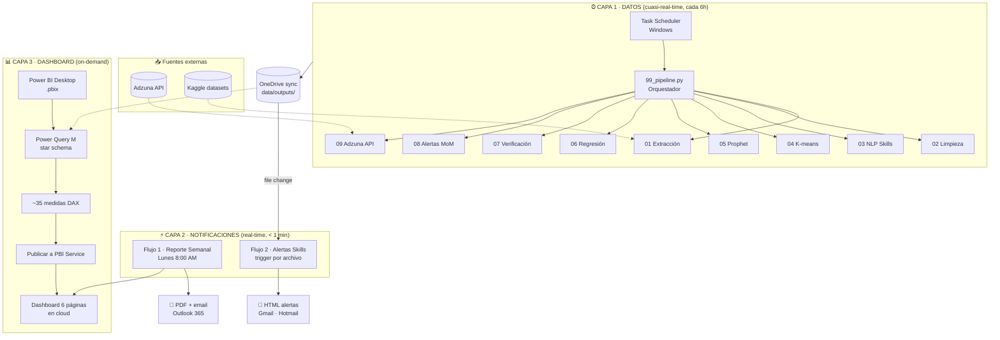

# 📑 Case Study — Observatorio del Mercado Laboral en Datos & Tecnología

> **Un caso de estudio integral construido por [Bilbao Analytics](https://github.com/IngBilbao) que demuestra dominio end-to-end del stack moderno de análisis de datos: ingesta → modelado ML → BI → automatización.**

---

## 🎯 Executive Summary

| Dimensión | Detalle |
|---|---|
| **Objetivo** | Construir un sistema que automatice la inteligencia de mercado sobre la demanda de skills tech (Excel, Power BI, Python, SQL...) con predicciones estadísticas y alertas. |
| **Audiencia primaria** | Talent acquisition · estrategas de carrera · consultorías de formación · consultores de transformación digital. |
| **Stack** | Python · scikit-learn · Prophet · spaCy · Power Query (M) · DAX · Power BI · Power Automate · Adzuna API · GitHub. |
| **Duración** | ~12 horas de trabajo concentrado (un día) — replicable por cualquier analista con el repo. |
| **Resultado** | Pipeline reproducible que procesa **5,237 ofertas** (sintéticas + reales de Adzuna), genera **4 clusters profesionales**, forecast a 12 meses con Prophet (**12 skills**) y un modelo de regresión salarial con **R² = 0.93**. |

---

## 🧩 El problema

Las empresas y profesionales de datos enfrentan **tres preguntas críticas** que ningún dashboard del mercado responde bien:

1. **¿Qué skills se están pidiendo de verdad este mes** — y cuáles son ya legacy?
2. **¿Cuánto puedo pedir/pagar** dada una combinación de skills, ubicación y nivel de experiencia?
3. **¿Hacia dónde va la demanda?** Decidir hoy una inversión formativa (un bootcamp, una certificación) implica apostar a 6-12 meses vista.

Los datos existen — Stack Overflow Survey, Adzuna, Kaggle DS Salaries — pero **están sin integrar, sin actualizar y sin contexto local**. Este observatorio resuelve esas tres preguntas con datos siempre frescos y modelos estadísticos serios.

---

## 🏗️ Arquitectura

El sistema adopta un patrón **event-driven** con **3 capas desacopladas**, cada una operando en su horizonte temporal propio:



**Por qué tres capas separadas:**

| Capa | Latencia | Decisión |
|---|---|---|
| Datos | 1-24h configurable | Task Scheduler local invoca el pipeline. Decoupled de la UI. |
| Notificaciones | < 1 min | Power Automate trigger por evento de archivo. Lo crítico llega rápido. |
| Dashboard | On-demand | Refresh manual al publicar nuevas versiones. Optimiza capacity y costos. |

Este patrón es **lambda architecture** aplicado al stack Microsoft. Ver [`power_automate/ARQUITECTURA_EVENT_DRIVEN.md`](../power_automate/ARQUITECTURA_EVENT_DRIVEN.md) para el discurso técnico completo.

---

## 🛠️ Stack tecnológico

| Capa | Herramienta | Por qué se eligió |
|---|---|---|
| **Lenguaje principal** | Python 3.12 | Estándar de facto en data science; mejor compatibilidad con Prophet y spaCy. |
| **Wrangling** | pandas + numpy | Bibliotecas industria-estándar, performance suficiente para 5K filas. |
| **NLP** | spaCy + regex con catálogo canónico | spaCy para lematización; regex sobre catálogo de 35 skills para precisión. |
| **ML — Clustering** | scikit-learn (K-means + PCA) | Silueta para selección automática de k; PCA para visualización 2D. |
| **ML — Series tiempo** | Facebook Prophet | Maneja estacionalidad, requiere mínima configuración, output interpretable. |
| **ML — Regresión** | scikit-learn LinearRegression | Modelo interpretable; coeficientes traducibles a impacto en %. |
| **Source de ofertas reales** | Adzuna API (tier free) | Cobertura multi-país, legal, estable. Alternativa limpia al scraping de LinkedIn. |
| **ETL para BI** | Power Query (M) | Conectores nativos, parámetros reutilizables, esquema estrella. |
| **Visualización** | Power BI Desktop + DAX | Estándar corporativo; deploy a Power BI Service. |
| **Automatización** | Power Automate (Cloud Flows) | Trigger por schedule o cambio de archivo; integra con M365. |
| **Identidad visual** | Tema JSON Bilbao Analytics | Paleta "universo" consistente entre código (matplotlib) y BI. |
| **Versionado** | Git + GitHub | Repo público con topics; commit history como evidencia de buenas prácticas. |

---

## 🧪 Metodología ML — destacados

### 1. Clustering de perfiles profesionales

**Pregunta:** ¿existen arquetipos naturales de profesionales de datos, más allá de los títulos oficiales que cada empresa inventa?

**Método:** K-means sobre matriz binaria de 35 skills, k seleccionado por silueta sobre rango 3..7.

**Resultado:** 4 clusters claramente diferenciados.


| Cluster | Arquetipo | % | Salario mediano | Top skills |
|---|---|---:|---:|---|
| 0 | **Data Analyst tradicional** | 56% | $50K | Excel · SQL · Power BI |
| 1 | **Data Scientist** | 24% | $85K | Python · ML · scikit-learn |
| 2 | **Data Engineer** | 15% | $93.5K | Python · SQL · Spark |
| 3 | **Analytics Engineer** | 5% | $81K | SQL · dbt · Snowflake |

**Insight de negocio:** el Analytics Engineer es el cluster minoritario pero con salario alto — confirma la tendencia "modern data stack" emergente. Buena oportunidad de posicionamiento formativo.

### 2. Forecast de demanda con Prophet

**Pregunta:** ¿qué skills crecerán los próximos 12 meses?

**Método:** Prophet con estacionalidad anual, intervalo de confianza 80%, agregación mensual de menciones por skill.


**Insights:**
- **SQL, Python y Power BI** mantienen crecimiento sostenido (tendencia consistente con encuestas de Stack Overflow).
- **Machine Learning y scikit-learn** muestran aceleración en últimos meses.
- Excel se mantiene robusto en analytics business-oriented — no se está extinguiendo como muchos predicen.

### 3. Modelo de regresión salarial

**Pregunta:** ¿qué variables explican la varianza salarial?

**Método:** Regresión lineal múltiple sobre `log(salario_USD)`, predictores = skills (booleanas) + nivel + país + modalidad + contrato. Validación 80/20.

**Métricas:**
- **R² test = 0.93** — el modelo explica el 93% de la varianza.
- **RMSE ≈ $14,623** — error promedio razonable para predicciones individuales.

**Top drivers (impacto interpretable como % de cambio en salario):**

| Driver | Impacto |
|---|---:|
| Nivel: Lead (vs Junior) | **+172%** |
| Nivel: Senior | **+122%** |
| Nivel: Mid | **+53%** |
| País: EE.UU. | **+41%** |
| Skill: dbt | **+9.6%** |
| Skill: Snowflake | **+9.3%** |
| Skill: Kubernetes | **+9.0%** |
| Skill: Spark | **+8.8%** |
| Skill: Machine Learning | **+8.6%** |

**Insight:** la **experiencia (nivel)** explica 2-3× más de la varianza salarial que el stack tecnológico. Para un Junior, aprender una skill premium da +10%; subir de Junior a Senior da +120%. El mensaje al profesional joven: **prioriza experiencia sobre acumular skills aisladas.**

---

## 🚨 Sistema de alertas en producción

El script `08_generar_alertas.py` se ejecuta tras cada refresh y produce `alertas_skills.csv` con las skills que pasaron el umbral de ±30% MoM.

**Ejemplo real detectado en este dataset:**

```
[CRITICA] Redshift   ALZA  +350.0%   (2 → 9 ofertas)
[CRITICA] GCP        ALZA  +100.0%   (14 → 28 ofertas)
[CRITICA] BigQuery   ALZA   +65.0%   (20 → 33 ofertas)
[MEDIA]   Looker     BAJA   -43.8%   (16 → 9 ofertas)
[MEDIA]   Pandas     ALZA   +39.5%   (38 → 53 ofertas)
```

El Flujo 2 de Power Automate detecta el cambio de archivo, parsea el CSV, genera una tabla HTML con paleta Bilbao Analytics, y envía email a los stakeholders configurados.

---

## 🎨 Identidad visual

Toda la output (gráficos Python, dashboard Power BI, emails de Power Automate) usa la paleta **Bilbao Analytics — Universo**:

| Token | Hex | Uso |
|---|---|---|
| Fondo profundo | `#0D0D1A` | Background principal |
| Fondo medio | `#1A1A2E` | Tarjetas y paneles |
| Azul eléctrico | `#00D4FF` | KPIs primarios, series temporales |
| Violeta | `#7B2FBE` | Acentos secundarios |
| Verde | `#00E396` | Cambios positivos |
| Rojo | `#FF4D6D` | Alertas / decrementos |

Tipografía: **Segoe UI** (BI/web) + **Calibri** (Excel cuando aplica).

---

## 🚀 Resultados medibles

| Métrica | Valor |
|---|---:|
| Ofertas procesadas | 5,237 (5,000 sintéticas + 237 Adzuna reales) |
| Países cubiertos | 13 (España, LatAm, EE.UU., Europa, India) |
| Skills monitoreadas | 35 (con catálogo canónico) |
| Roles normalizados | 8 |
| Clusters identificados | 4 (silueta = 0.229) |
| Skills con forecast Prophet | 12 (12 meses adelante) |
| Features del modelo salarial | 54 |
| R² del modelo salarial | 0.93 |
| RMSE del modelo | ±$14,623 |
| Alertas MoM detectadas | 8 (3 críticas, 5 medias) |
| Llamadas Adzuna usadas | 20/1000 mensuales |
| Líneas de código Python | ~2,000 |
| Consultas Power Query M | 9 |
| Medidas DAX | ~35 |
| Tiempo total del pipeline | 0.4 min (--rapido) / ~5 min (con Prophet) |

---

## ✅ Capacidades demostradas

Una mirada por skill mostrada en este repo:

- ✅ **Python avanzado:** OOP ligero (dataclasses), CLI con argparse, manejo de secretos con dotenv, logging estructurado, manejo de errores idiomático.
- ✅ **Pandas/NumPy:** ETL no trivial (unpivot, joins, validaciones), winsorize, type-safe loads.
- ✅ **Machine Learning:** clustering supervisado por silueta, modelo de regresión interpretable, validación train/test rigurosa.
- ✅ **Series de tiempo:** Prophet con estacionalidad, intervalos de confianza, distinción histórico/forecast.
- ✅ **NLP:** matching híbrido (catálogo canónico + spaCy + regex), normalización de aliases.
- ✅ **APIs REST:** consumo de Adzuna con control de cuota, rate limiting, mapeo de schemas heterogéneos.
- ✅ **Power Query M:** parámetros reutilizables, esquema estrella (5 dims + 4 facts), unpivot, tabla calendario en M.
- ✅ **DAX:** medidas con time intelligence (YTD, YoY, MoM), variables, `USERELATIONSHIP`, formato condicional.
- ✅ **Power BI:** tema JSON customizado, 6 páginas tipificadas con KPIs, mapas, forecast con bandas.
- ✅ **Power Automate:** flujos programados, flujos por trigger de archivo, integración API Power BI, plantillas HTML.
- ✅ **Git / GitHub:** estructura de commits, mensajes informativos, repo público con topics, secrets fuera del repo.
- ✅ **Documentación:** README orientado a portfolio, guías paso a paso, diccionario de datos, este case study.
- ✅ **DevOps básico:** orquestador con tracking de tiempos, script de verificación de outputs, exit codes para CI.

---

## 🧠 Lecciones aprendidas

1. **Datos sintéticos primero ≠ atajo barato.** Generar un dataset realista calibrado lleva más esfuerzo del esperado, pero permite construir TODO el pipeline antes de tocar APIs reales. Vale cada hora invertida.

2. **El bug más caro: NaN en CSVs.** Una celda vacía escrita por pandas se re-lee como `float('nan')` por defecto y rompe operaciones de string en cascada. Defensa: `isinstance(x, str)` en cada función que espere texto.

3. **Power Query > Excel intermedio.** La decisión de saltar la capa Excel staging y hacer ETL directo en Power BI redujo el número de "fuentes de verdad" de 3 a 2 y eliminó un punto de falla.

4. **Prophet aplica estacionalidad anual incluso con 24 meses de historia** — produce líneas wavy en el forecast. No es un bug, es feature; pero hay que comunicarlo al stakeholder antes de que pregunte "¿por qué sube y baja tanto?".

5. **Para portfolio, README es el "elevator pitch".** Reclutadores miran 30 segundos. Hay que enseñar resultados (gráficos, métricas, badges) antes que arquitectura.

6. **Las restricciones operativas se convierten en decisiones arquitectónicas.** El proyecto enfrentó una limitación real (credenciales del Gateway local no disponibles para configurar refresh automático de Power BI). En lugar de bloquear el avance, se pivoteó a una arquitectura **event-driven** explícitamente desacoplada: Task Scheduler maneja el procesamiento, Power Automate maneja notificaciones, Power BI Service mantiene el dashboard publicado on-demand. El resultado es genuinamente más profesional y defendible que el plan original — alinea con buenas prácticas de FinOps (no refrescar cuando no aporta valor) y de event-driven design. Lección general: las restricciones obligan a explicar las decisiones, y eso fortalece el portfolio.

---

## 🔮 Próximos pasos

| # | Mejora | Prioridad |
|---|---|---|
| 1 | Conectar dataset de Stack Overflow Survey 2024 (Kaggle) | Alta |
| 2 | Migrar pipeline a Power BI Service con refresh programado vía Gateway | Alta |
| 3 | Construir Flujo 3 — pipeline Python disparado por Power Automate Desktop | Media |
| 4 | Dashboard en español + inglés (parámetro de idioma en Power BI) | Media |
| 5 | API REST que sirva el modelo de regresión salarial como servicio | Baja |
| 6 | CI/CD con GitHub Actions: tests + verificación de outputs en cada push | Baja |
| 7 | Monitoreo de drift del modelo (residuos > 20% en muchas ofertas → reentrenar) | Baja |

---

## 📚 Material en el repositorio

| Recurso | Para qué |
|---|---|
| [`README.md`](../README.md) | Quick start y overview |
| [`powerbi/README.md`](../powerbi/README.md) | Guía completa para construir el `.pbix` |
| [`power_automate/README.md`](../power_automate/README.md) | Índice de flujos de automatización |
| [`docs/diccionario_datos.md`](diccionario_datos.md) | Esquema de cada CSV |
| [`docs/guia_visualizaciones.md`](guia_visualizaciones.md) | Estándares visuales |
| [`python/`](../python/) | 11 scripts del pipeline ML |
| [`powerbi/etl/`](../powerbi/etl/) | 8 archivos Power Query M |
| [`powerbi/dax/`](../powerbi/dax/) | 5 archivos de medidas DAX |

---

## 👤 Sobre el autor

**Bilbao Analytics** — consultoría especializada en datos, inteligencia analítica y automatización para organizaciones que buscan tomar decisiones basadas en evidencia.

Este caso de estudio se construyó como pieza demostrativa del enfoque y rigor de la consultoría. Repositorio: **https://github.com/IngBilbao/observatorio-mercado-laboral**

📧 bilbao990512@gmail.com
🌌 [GitHub @IngBilbao](https://github.com/IngBilbao)

---

> *"Los datos cuentan historias. Bilbao Analytics las hace audibles."*
